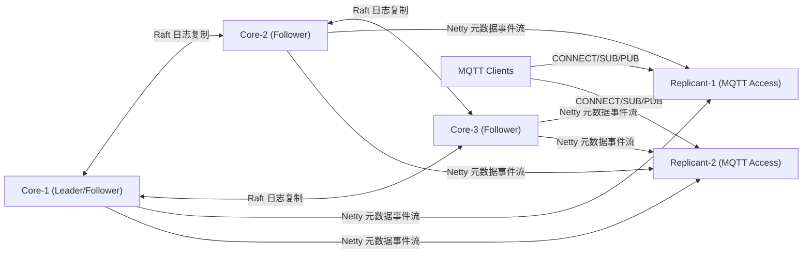

# jmqx

`jmqx` 是一个基于 Java + Netty 的 MQTT Broker 服务器。

## 项目结构分析

- `jmqx-common`: 通用配置与工具类（`com.jmqx.common`）。
- `jmqx-protocol`: 核心协议边界接口（`com.jmqx.protocol`，如 `ClientAuthenticator`、`BrokerMessageHandler`），用于解耦 `transport` 与 `core`。
- `jmqx-plugin`: Auth/ACL 插件实现与工厂（`com.jmqx.auth`、`com.jmqx.acl`）。
- `jmqx-core`: Broker 核心、会话、路由、存储（`com.jmqx.broker`、`session/router/store`）。
- `jmqx-transport`: Netty TCP 接入与连接指标（`com.jmqx.transport`）。
- `jmqx-bench`: 自研 MQTT 压测模块（`com.jmqx.bench`）。
- `jmqx-app`: 启动装配模块（`com.jmqx.JmqxApplication` + `jmqx.properties`）。

## 当前已填充能力

- Maven 多模块结构。
- 可启动的 MQTT TCP 服务端（默认 `0.0.0.0:1883`）。
- 支持消息流程：
  - CONNECT + CONNACK
  - SUBSCRIBE + SUBACK（订阅后回放 retained）
  - PUBLISH（支持 QoS 0/1 基本流，QoS1 返回 PUBACK）
  - PINGREQ + PINGRESP
  - DISCONNECT / 连接断开时会话清理
- 支持 retained message 的保存、删除（空 payload）与订阅回放。
- 支持共享订阅（`$share/{group}/{topicFilter}`），同组内消息按轮询投递到一个客户端。
- 提供认证插件化能力（`allow_all/http/file/redis/db`）。
- 支持遗嘱消息（Will）：客户端非正常断开时自动发布遗嘱。
- 支持连接/断开公共事件 Topic：
  - `$SYS/jmqx/events/client/connected`
  - `$SYS/jmqx/events/client/disconnected`

## 启动方式

1. 安装 JDK 17。
2. 安装 Maven 3.9+。
3. 在仓库根目录执行：

```bash
mvn -DskipTests compile
mvn -pl jmqx-app -am exec:java
```

压测工具启动示例：

```bash
mvn -pl jmqx-bench -am exec:java -Dexec.args="--host=127.0.0.1 --port=1883 --clients=10000 --connectRate=2000 --subscribe=false --publishRate=0"
```

## 配置

默认配置文件：`jmqx-app/src/main/resources/jmqx.properties`

配置优先级：`JVM 参数 > jmqx.properties > 代码默认值`。

30 万连接里程碑模板：

- 配置模板：`jmqx-app/src/main/resources/jmqx-300k.properties`
- 执行手册：`docs/milestone-300k-single-node.md`

## 集群部署方案（Core + Replicant）

当前集群采用以下模型：

- Core 节点：负责元数据写入与强一致复制（SOFAJRaft）。
- Replicant 节点：负责海量客户端接入与本地只读路由查询，通过 Netty 异步接收 Core 已提交日志。

推荐最小拓扑：

- 3 个 Core（奇数，保证多数派）
- N 个 Replicant（按连接规模横向扩容）

### 集群架构示意图



### 集群配置详细说明

| 配置项 | 默认值 | 角色 | 说明 | 建议 |
|---|---:|---|---|---|
| `jmqx.cluster.role` | `core` | Core/Replicant | 节点角色 | Replicant 接入节点必须设为 `replicant` |
| `jmqx.cluster.coreEndpoints` | `127.0.0.1:7800` | Core/Replicant | Core 元数据服务地址列表（逗号分隔） | 所有节点保持一致并使用内网地址 |
| `jmqx.cluster.core.bindHost` | `0.0.0.0` | Core | Core Netty 元数据服务绑定地址 | 生产建议绑定内网网卡 |
| `jmqx.cluster.core.port` | `7800` | Core | Core Netty 元数据服务端口 | 与防火墙放通策略一致 |
| `jmqx.cluster.netty.requestTimeoutMs` | `3000` | Replicant | 写请求到 Core 的超时 | 低延迟内网建议 `1000~3000` |
| `jmqx.cluster.netty.reconnectBackoffMs` | `1000` | Replicant | 同步通道重连基准退避 | 不建议低于 `300` |
| `jmqx.cluster.netty.ackBatchSize` | `64` | Replicant | ACK 批量阈值（事件条数） | 大吞吐可调高到 `128~512` |
| `jmqx.cluster.netty.ackFlushIntervalMs` | `200` | Replicant | ACK 最长刷出间隔 | 建议 `100~500` |
| `jmqx.cluster.netty.replicantMaxInFlightEvents` | `2048` | Core | Core 向单个 Replicant 的最大未 ACK 窗口 | 慢消费者多时调低 |
| `jmqx.cluster.netty.replicantPushBatchSize` | `256` | Core | Core 单次推送上限 | 建议不超过 `1024` |
| `jmqx.cluster.nodeDownCleanupDelayMs` | `15000` | Core | Replicant 断连后路由清理延迟（毫秒） | 网络抖动多时建议调大 |
| `jmqx.cluster.replay.maxEvents` | `200000` | Core | Core 内存重放缓冲上限 | 大集群可提升并关注内存 |
| `jmqx.cluster.raft.groupId` | `jmqx-metadata` | Core | Raft 组名 | 同一集群内保持一致 |
| `jmqx.cluster.raft.serverId` | `127.0.0.1:17800` | Core | 当前 Core 的 Raft 地址 | 必须是本机可达 IP:Port |
| `jmqx.cluster.raft.initialConf` | `127.0.0.1:17800` | Core | 初始 Raft 成员列表 | 首次建群时所有 Core 保持一致 |
| `jmqx.cluster.raft.dataPath` | `data/raft-metadata` | Core | Raft 日志/元数据/快照目录 | 建议独立高性能磁盘 |
| `jmqx.cluster.raft.electionTimeoutMs` | `1000` | Core | 选举超时 | 跨机房请适当调大 |
| `jmqx.cluster.raft.snapshotIntervalSecs` | `30` | Core | 快照周期（秒） | 写入密集可适当缩短 |

### 端口规划建议

- MQTT/MQTTS/WS/WSS 业务端口：按节点实际暴露
- 集群元数据通道（Core 对外）：`jmqx.cluster.core.port`，默认 `7800`
- Raft 端口（Core 间通信）：`jmqx.cluster.raft.serverId` 中的 `ip:port`，例如 `127.0.0.1:17800`

注意：`jmqx.cluster.raft.serverId` 必须是明确 IP，不可使用 `0.0.0.0`。

### Core 节点配置示例

Core-1:

```bash
-Djmqx.cluster.role=core
-Djmqx.cluster.core.bindHost=0.0.0.0
-Djmqx.cluster.core.port=7800
-Djmqx.cluster.coreEndpoints=10.0.0.11:7800,10.0.0.12:7800,10.0.0.13:7800
-Djmqx.cluster.raft.groupId=jmqx-metadata
-Djmqx.cluster.raft.serverId=10.0.0.11:17800
-Djmqx.cluster.raft.initialConf=10.0.0.11:17800,10.0.0.12:17800,10.0.0.13:17800
-Djmqx.cluster.raft.dataPath=/data/jmqx/raft
```

Core-2 / Core-3 仅替换 `raft.serverId` 与本机 IP，`initialConf` 保持一致。

### Replicant 节点配置示例

```bash
-Djmqx.cluster.role=replicant
-Djmqx.cluster.coreEndpoints=10.0.0.11:7800,10.0.0.12:7800,10.0.0.13:7800
-Djmqx.cluster.netty.requestTimeoutMs=3000
-Djmqx.cluster.netty.reconnectBackoffMs=1000
-Djmqx.cluster.netty.ackBatchSize=64
-Djmqx.cluster.netty.ackFlushIntervalMs=200
-Djmqx.cluster.netty.replicantMaxInFlightEvents=2048
-Djmqx.cluster.netty.replicantPushBatchSize=256
```

### 启动顺序建议

1. 先启动全部 Core，确认 Raft 选主成功。
2. 再启动 Replicant，让其订阅 Core 日志并追平。
3. 最后把客户端流量切到 Replicant 节点。

### 验证步骤

1. 在任一 Replicant 上发起订阅/取消订阅操作。
2. 观察 Core 日志中元数据提交成功。
3. 观察其他 Replicant 接收增量日志并 ACK。
4. 人工下线一个 Core，验证写请求可重定向到新 Leader。

## 当前定位

当前版本已支持 Core + Replicant 集群元数据复制，仍建议优先在压测与故障演练后再用于生产流量。

可通过 JVM 参数覆盖默认监听地址与端口：

```bash
-Djmqx.broker.host=0.0.0.0
-Djmqx.broker.port=1883
-Djmqx.broker.mqtts.enabled=false
-Djmqx.broker.mqtts.host=0.0.0.0
-Djmqx.broker.mqtts.port=8883
-Djmqx.broker.bossThreads=1
-Djmqx.broker.workerThreads=0
-Djmqx.broker.readerIdleSeconds=120
-Djmqx.broker.websocket.enabled=true
-Djmqx.broker.websocket.host=0.0.0.0
-Djmqx.broker.websocket.port=8083
-Djmqx.broker.websocket.path=/mqtt
-Djmqx.broker.wss.enabled=false
-Djmqx.broker.wss.host=0.0.0.0
-Djmqx.broker.wss.port=8084
-Djmqx.broker.wss.path=/mqtt
-Djmqx.broker.tls.certChainFile=/path/to/server.crt
-Djmqx.broker.tls.privateKeyFile=/path/to/server.key
-Djmqx.broker.tls.privateKeyPassword=
```

`jmqx.broker.readerIdleSeconds` 为读空闲超时秒数，设为 `0` 可关闭空闲连接检测。
`jmqx.broker.websocket.enabled=false` 可关闭 websocket 接入。
`jmqx.broker.mqtts.enabled=true` 或 `jmqx.broker.wss.enabled=true` 后，需要同时配置 TLS 证书与私钥路径。

Retained 内存保护配置（默认启用）：

```bash
-Djmqx.retained.rocksdb.path=data/retained-rocksdb
-Djmqx.retained.maxEntries=100000
-Djmqx.retained.maxBytes=268435456
-Djmqx.retained.maxPayloadBytes=1048576
-Djmqx.retained.overflowStrategy=evict_lru
```

`jmqx.retained.overflowStrategy` 支持：
- `evict_lru`：超限时按 LRU 淘汰旧 retained（默认）
- `reject_new`：超限时拒绝新 retained 写入

Shared subscription manager:

```bash
-Djmqx.shared.maxSubscribersPerGroup=1000
-Djmqx.shared.slowConsumerStrikeThreshold=3
```

WebSocket MQTT 接入地址示例：

```text
ws://127.0.0.1:8083/mqtt
```

MQTTS / WSS 接入地址示例：

```text
mqtts://127.0.0.1:8883
wss://127.0.0.1:8084/mqtt
```

## 用户密码认证插件化

Broker 已支持认证插件化，内置 5 种类型：

- `allow_all`：全部放行（默认）
- `http`：通过 HTTP 请求外部认证服务
- `file`：读取本地账号文件
- `redis`：通过 Redis `GET` 查询用户密码
- `db`：通过数据库 SQL 查询用户密码

公共参数：

```bash
-Djmqx.auth.type=allow_all|http|file|redis|db
-Djmqx.auth.chain=file,redis,http
-Djmqx.auth.cacheMillis=60000
```

`jmqx.auth.cacheMillis` 为认证结果本地缓存毫秒数，默认 `60000`；设为 `0` 可关闭缓存。
`jmqx.auth.chain` 为链式鉴权顺序，按顺序执行；当前插件返回“未命中(not found)”时会继续下一个插件，全部未命中则拒绝。

### HTTP Auth

```bash
-Djmqx.auth.type=http
-Djmqx.auth.http.url=http://127.0.0.1:8080/auth/check
-Djmqx.auth.http.timeoutMs=2000
```

请求体示例：

```json
{"clientId":"c1","username":"alice","password":"alice123"}
```

响应体支持：

- `{"allow": true}` / `true` / `allow`
- `{"notFound": true}` / `not_found` / `notfound`（表示未命中，链式场景会继续后续插件）
- 其他返回都视为认证失败

### File Auth

```bash
-Djmqx.auth.type=file
-Djmqx.auth.file.path=auth-users.txt
```

文件格式（每行一条）：

```text
alice:alice123
admin:admin123
```

### Redis Auth

```bash
-Djmqx.auth.type=redis
-Djmqx.auth.redis.host=127.0.0.1
-Djmqx.auth.redis.port=6379
-Djmqx.auth.redis.password=
-Djmqx.auth.redis.db=0
-Djmqx.auth.redis.keyPrefix=jmqx:auth
-Djmqx.auth.redis.timeoutMs=2000
```

键格式：`{prefix}:{username}`，值为明文密码。示例：

```text
jmqx:auth:alice = alice123
jmqx:auth:admin = admin123
```

### DB Auth

```bash
-Djmqx.auth.type=db
-Djmqx.auth.db.driver=com.mysql.cj.jdbc.Driver
-Djmqx.auth.db.url=jdbc:mysql://127.0.0.1:3306/jmqx
-Djmqx.auth.db.user=root
-Djmqx.auth.db.password=123456
-Djmqx.auth.db.query=SELECT password FROM mqtt_user WHERE username = ?
```

默认读取 SQL 第一列作为用户密码，并与客户端密码做等值比较。

## 消息桥接（Kafka / RocketMQ / MySQL）

Broker 在处理到 `PUBLISH` 后，除了本地路由，还可以把消息桥接转发到外部系统。

- 支持类型：`kafka`、`rocketmq`、`mysql`
- 支持多目标并行：`jmqx.bridge.types=kafka,rocketmq,mysql`
- 支持异步投递：基于 Disruptor RingBuffer（无锁）+ worker 线程（队列满时丢弃并记录日志）

公共参数：

```bash
-Djmqx.bridge.enabled=true
-Djmqx.bridge.types=kafka,rocketmq,mysql
-Djmqx.bridge.async=true
-Djmqx.bridge.async.queueCapacity=10000
-Djmqx.bridge.async.workerCount=1
```

Kafka 参数：

```bash
-Djmqx.bridge.kafka.bootstrapServers=127.0.0.1:9092
-Djmqx.bridge.kafka.topic=jmqx-messages
-Djmqx.bridge.kafka.acks=1
-Djmqx.bridge.kafka.clientId=jmqx-bridge
-Djmqx.bridge.kafka.compressionType=none
```

RocketMQ 参数：

```bash
-Djmqx.bridge.rocketmq.nameServer=127.0.0.1:9876
-Djmqx.bridge.rocketmq.producerGroup=jmqx-bridge-group
-Djmqx.bridge.rocketmq.topic=JMQX_MESSAGES
-Djmqx.bridge.rocketmq.syncSend=false
-Djmqx.bridge.rocketmq.timeoutMs=3000
```

MySQL 参数：

```bash
-Djmqx.bridge.mysql.driver=com.mysql.cj.jdbc.Driver
-Djmqx.bridge.mysql.url=jdbc:mysql://127.0.0.1:3306/jmqx
-Djmqx.bridge.mysql.user=root
-Djmqx.bridge.mysql.password=123456
-Djmqx.bridge.mysql.table=jmqx_bridge_message
-Djmqx.bridge.mysql.autoCreateTable=true
```

## ACL 插件化鉴权

Broker 已支持 ACL 插件化，内置 4 种类型：

- `allow_all`：全部放行（默认）
- `http`：通过 HTTP 请求外部鉴权服务
- `redis`：通过 Redis `GET` 查询规则
- `file`：读取本地规则文件

公共参数：

```bash
-Djmqx.acl.type=allow_all|http|redis|file
-Djmqx.acl.defaultAllow=false
-Djmqx.acl.cacheMillis=60000
```

`jmqx.acl.cacheMillis` 为 ACL 本地缓存毫秒数，默认 `60000`；设为 `0` 可关闭缓存。

### HTTP ACL

```bash
-Djmqx.acl.type=http
-Djmqx.acl.http.url=http://127.0.0.1:8080/acl/check
-Djmqx.acl.http.timeoutMs=2000
```

请求体示例：

```json
{"clientId":"c1","username":"u1","topic":"test/a","action":"publish"}
```

响应体支持：

- `{"allow": true}` / `true` / `allow`
- `{"allow": false}` / `false` / `deny`

### Redis ACL

```bash
-Djmqx.acl.type=redis
-Djmqx.acl.redis.host=127.0.0.1
-Djmqx.acl.redis.port=6379
-Djmqx.acl.redis.password=
-Djmqx.acl.redis.db=0
-Djmqx.acl.redis.keyPrefix=jmqx:acl
-Djmqx.acl.redis.timeoutMs=2000
```

键格式：

`{prefix}:{action}:{username}:{topic}`

示例：

```text
jmqx:acl:publish:alice:sensor/temp = allow
jmqx:acl:publish:alice:* = deny
jmqx:acl:subscribe:alice:sensor/# = allow
jmqx:acl:subscribe:*:* = deny
```

值支持：`allow/deny/true/false/1/0`。

说明：Redis 模式是按键查询（`GET`），更适合精确 topic 或 `*` 级别通配；复杂 ACL 规则建议使用 `file` 或 `http` 模式。

### File ACL

```bash
-Djmqx.acl.type=file
-Djmqx.acl.file.path=acl-rules.txt
```

规则文件格式（每行一条）：

```text
allow publish alice sensor/#
deny  subscribe bob   secure/#
allow * * #
```

### JDK 17 startup error fix

If startup fails with:

`Unable to make field transient java.lang.Object[] java.util.ArrayList.elementData accessible`

this is caused by JDK module encapsulation for reflective access.

For Maven startup, the project already includes:

- `.mvn/jvm.config`
- `--add-opens=java.base/java.util=ALL-UNNAMED`

If you run `JmqxApplication` directly in IDE, add the same VM option manually:

`--add-opens=java.base/java.util=ALL-UNNAMED`
